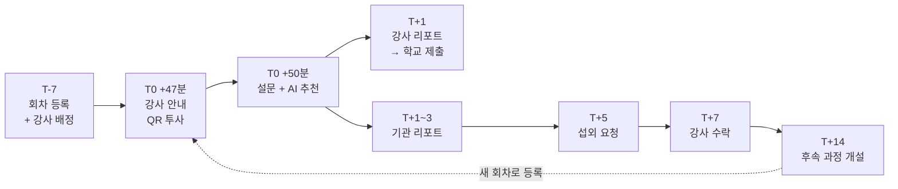
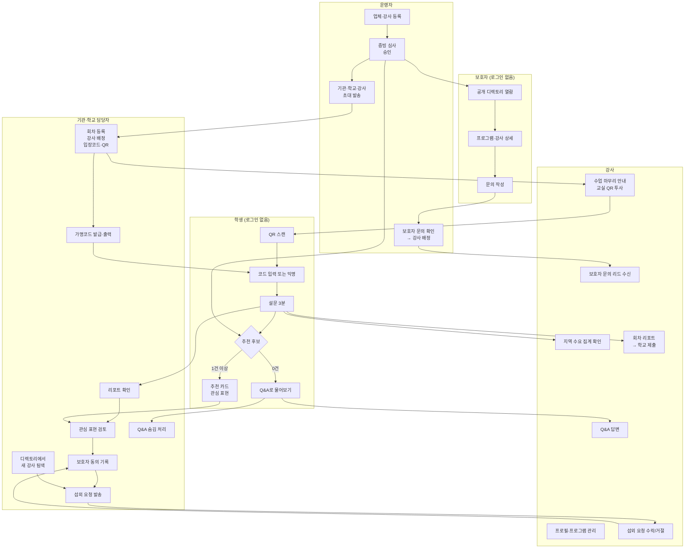
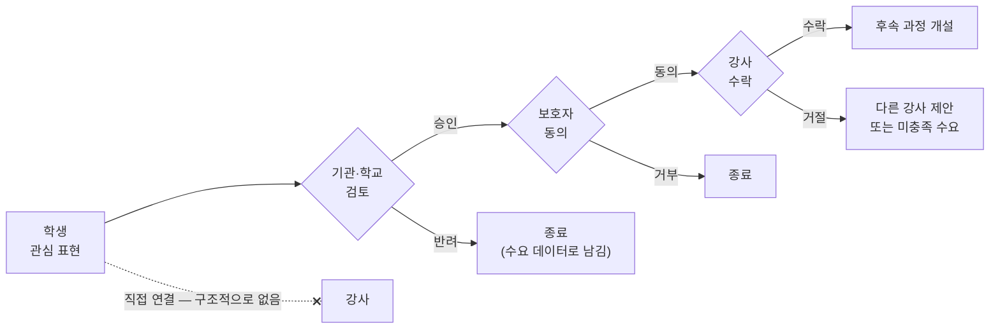
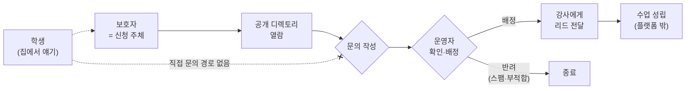
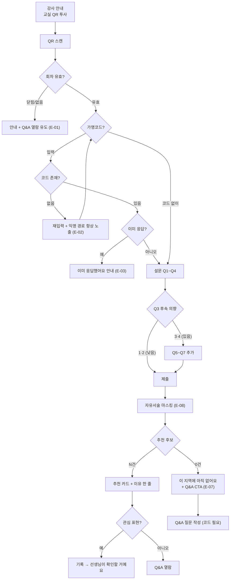
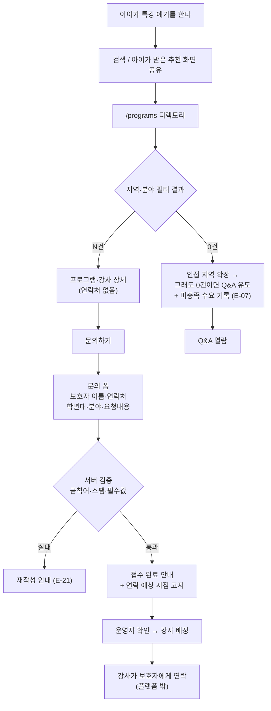
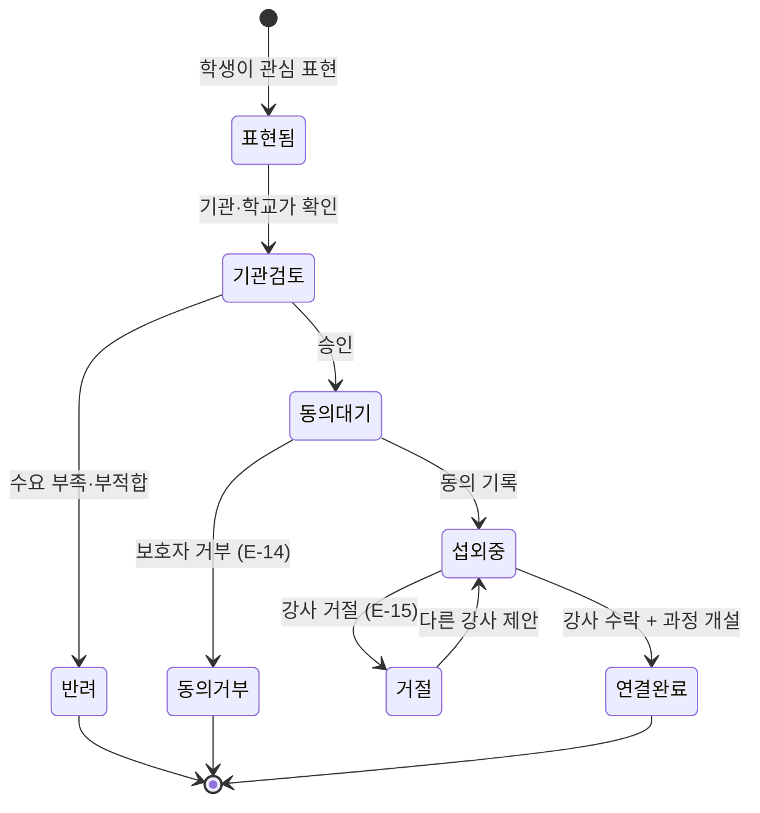
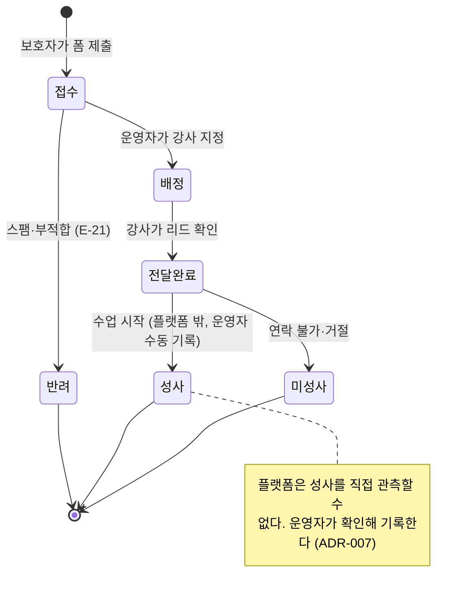
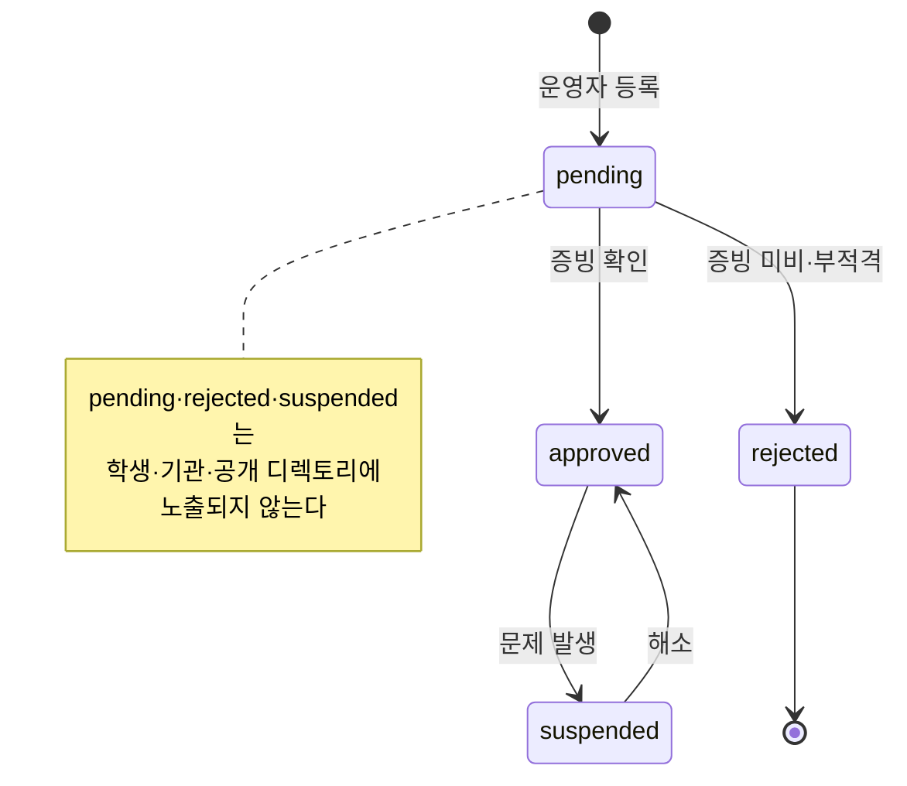

# 사용자 흐름과 시나리오

"누가 언제 무엇을 하는가"를 정의한다. 화면 명세가 아니라 흐름 명세다.
구현 step은 이 문서의 유스케이스(UC)와 예외(E) 번호를 AC에 인용한다.

이 제품의 매칭은 **세 갈래**다. 아래 흐름 전체가 이 세 갈래로 갈라진다.

```
강사 ↔ 학교        학교 담당교사가 회차를 열고, 수요를 보고, 새 강사를 발굴한다
강사 ↔ 기관        청소년재단·교육업체 담당자가 같은 일을 연간 사업 단위로 한다
강사 ↔ 학생 개인   공개 디렉토리를 본 성인 보호자가 문의한다 (학생은 주체가 아니다)
```

---

## 1. 사용자 6명

| # | 사용자 | 구체 상황 | 앱을 여는 순간 | 1회 사용 시간 |
|---|---|---|---|---|
| P1 | **학생** 민지 (중2) | 광명 하안중. 3DNFLY 드론 특강을 막 들었다 | 특강 끝난 교실, **강사가 "QR 찍으면 너한테 맞는 다음 교육 찾아줘"라고 말한 직후** | 3분 × 1회 (+ Q&A 재방문) |
| P2 | **기관 담당자** 박 주임 (35) | 광명시 청소년기관 진로사업 담당. 연 30회 특강 운영 | 특강 전날(회차 등록), 다음 날(리포트) | 10~20분 × 주 1~2회 |
| P3 | **학교 담당교사** 이 선생 (41) | 광명 고교 진로전담. 고교학점제 선택과목에 넣을 외부 강사를 찾아야 한다 | 학기 편성 전(강사 탐색), 특강 전후(회차·리포트) | 20~30분 × 월 1~2회 |
| P4 | **강사** 김 선생 (32) | 3DNFLY 소속 드론 강사. 월 8~12회 출강 | **수업 마지막 3분(QR 투사)**, 수업 후(리포트 확보), Q&A·섭외·문의가 올 때 | 5분 × 주 2~3회 |
| P5 | **보호자** 최 씨 (43) | 아이가 드론 특강 얘기를 계속 한다. 계속 배울 곳을 찾는다 | **아이 말을 듣고 검색해서 디렉토리에 도달한 날 저녁 1회** | 5~10분 × 1회 |
| P6 | **운영자** (기획자 본인) | 3DNFLY 인턴. 1인 운영 | 강사 등록·심사, 초대 발송, 문의 배정, 미답변 점검 | 10분 × 매일 |

**P3이 새로 들어왔다.** 학교는 `organizations.type = 'school'`이므로 P2와 같은 화면을 쓴다(ADR-013). 다르게 만들 화면은 없지만 **오는 이유가 다르다** — P2는 연간 사업의 수요 근거를 원하고, P3은 **인맥 밖의 새 강사**를 원한다. 화면 문구와 빈 상태 안내가 이 차이를 반영해야 한다.

**P5가 달라졌다.** 기존 설계에서 보호자는 "앱을 열지 않는다"였다. 이제 **두 역할**을 가진다.

- **동의권자** — 기관 경로. 여전히 앱을 열지 않는다. 기관의 기존 절차(종이·문자·알림장)로 동의를 받고 플랫폼은 **동의 여부만 기록**한다. 보호자 포털을 만들면 동의율이 그 포털의 가입률에 묶이므로 이 설계는 유지한다.
- **문의자** — 개인 경로. 계정 없이 공개 디렉토리를 보고 문의 폼을 1회 작성한다. 로그인·마이페이지를 만들지 않는다 (ADR-014).

---

## 2. 시간축 여정

한 번의 특강이 후속 과정으로 이어지는 전체 주기. 이 14일이 제품의 단위다.

| 시점 | 주체 | 하는 일 | UC |
|---|---|---|---|
| **T-7** | 기관·학교 | 특강 일정 확정 → 회차 등록, **배정 강사 지정**, 입장코드·QR 발급 | UC-01 |
| **T-3** | 기관·학교 | 학생 가명코드 일괄 발급 → 출력해서 준비 | UC-02 |
| **T-1** | 운영자 | 해당 분야 강사가 승인 상태인지 점검 | UC-25 |
| **T0 +0분** | 강사 | 특강 진행 (플랫폼 밖) | — |
| **T0 +47분** | 강사 | **수업 마무리 안내 + 교실 QR 투사.** 학생 유입의 실제 트리거 | **UC-28** |
| **T0 +50분** | 학생 | QR 스캔 → 코드 입력 → 설문 3분 | UC-03~06 |
| **T0 +53분** | 학생 | AI 추천 확인 → 관심 표현 **또는** Q&A 질문 | UC-07~10 |
| **T+1** | 강사 | Q&A 답변 | UC-14 |
| **T+1** | 강사 | **회차 리포트 확보 → 학교·기관에 제출** | **UC-29** |
| **T+1~3** | 기관·학교 | 리포트 확인 (만족도·후속 의향·분야별·미충족 수요) | UC-17~18 |
| **T+3** | 기관·학교 | 관심 표현 검토 → 보호자 동의 절차 시작 | UC-19~20 |
| **T+5** | 기관·학교 | 섭외 요청 발송 | UC-21 |
| **T+7** | 강사 | 요청 수락 → 일정 제안 | UC-16 |
| **T+7~10** | 기관·학교 | 동의 회수 기록 → 후속 과정 확정 | UC-20 |
| **T+14** | 기관·학교 | 후속 과정 시작. **이 과정도 새 회차로 등록** | UC-27 |
| **T+14 이후** | — | → T0으로 돌아간다 (루프) | — |



**개인 경로는 이 14일 타임라인 밖에서 비동기로 일어난다.** 아이가 집에서 특강 얘기를 한 날 저녁, 보호자가 검색으로 디렉토리에 도달한다. 회차와 연결되지 않으므로 별도 흐름으로 다룬다(6절).

---

## 3. 전체 흐름 (5개 역할)



**없는 선이 두 개다.** (1) 학생에서 강사로 가는 직선 — 기관을 지나지 않는 연결은 없다. (2) 보호자에서 강사로 가는 직선 — 문의는 반드시 운영자를 경유해 배정된다. 보호자가 강사 연락처를 직접 얻는 경로는 존재하지 않는다.

---

## 4. 연결 게이트 — 이 제품의 핵심 메커니즘

### 4-1. 기관·학교 경로 (게이트 3개)

학생의 관심이 실제 교육으로 바뀌는 경로에는 **게이트가 3개** 있다. 하나라도 통과하지 못하면 연결은 성립하지 않는다.



게이트를 줄이자는 제안이 나오면 거절할 근거: 게이트가 곧 학교·기관이 이 서비스를 도입할 수 있는 이유다. 편의를 위해 하나를 빼면 도입 자체가 불가능해진다.

### 4-2. 개인 경로 (게이트 2개)

개인 경로의 첫 게이트는 **주체가 성인이라는 사실 자체**다. 학생은 이 흐름에 진입할 수 없다.



운영자 게이트를 자동화하지 않는 이유: 문의는 anon INSERT로 들어오므로 스팸·도배가 섞인다. 그리고 어느 강사에게 줄지는 지역·분야·가능 여부를 사람이 보는 게 정확하다. 문의량이 하루 수십 건을 넘으면 다시 결정한다(ADR-008과 같은 원칙).

---

## 5. 학생 여정 상세 (분기 포함)



**진입 문구는 "만족도 조사"가 아니다.** 학생이 찍는 이유는 본인 이득이어야 하므로 첫 화면의 주제는 "나한테 맞는 다음 교육 찾기"다. 만족도는 그 안의 한 문항이다 (PRD 확정 결정 5번 "학생에게 이 화면은 만족도 조사가 아니다").

---

## 6. 보호자(개인) 여정 상세



**이 흐름에서 지켜야 할 것 3개.**

1. 폼에 **아이 이름·학교 입력란을 만들지 않는다.** 학년대(초/중/고)까지만 받는다.
2. 접수 완료 화면에서 **언제 연락이 가는지 고지한다.** 운영자 수동 배정이므로 즉시 연락이 아니다. 이걸 안 쓰면 문의가 "씹혔다"고 느낀다.
3. **강사 연락처를 화면 어디에도 두지 않는다.** 연락은 강사 → 보호자 방향으로만 일어난다.

---

## 7. 유스케이스 34개

| UC | 주체 | 내용 | step | 관련 가설 |
|---|---|---|---|---|
| UC-01 | 기관·학교 | 특강 회차 생성, **배정 강사 지정**, 입장코드·QR 발급 | 10 | — |
| UC-02 | 기관·학교 | 학생 가명코드 일괄 발급·인쇄용 출력 | 10 | H1 |
| UC-03 | 학생 | QR 스캔으로 회차 진입 | 6 | H1 |
| UC-04 | 학생 | 가명코드로 식별 | 6 | H1 |
| UC-05 | 학생 | 코드 없이 익명 참여 | 6 | H1 |
| UC-06 | 학생 | 설문 응답 (필수 4 + 조건부 3) | 6 | H1·H2 |
| UC-07 | 학생 | AI 추천 확인 | 7·8 | H3 |
| UC-08 | 학생 | 관심 표현 | 8 | H3 |
| UC-09 | 학생 | 추천 0건 → Q&A 유도 | 8 | H4 |
| UC-10 | 학생 | Q&A 질문 작성 (코드 필요) | 9 | H4 |
| UC-11 | 누구나 | Q&A 열람 (인증 없음) | 9 | H4 |
| UC-12 | 강사 | 초대 수락 → 계정 생성 | 4 | — |
| UC-13 | 강사 | 프로필·프로그램 확인·수정 | 12 | — |
| UC-14 | 강사 | Q&A 답변 | 9·12 | H6 |
| UC-15 | 강사 | 지역 수요 집계 확인 | 12 | H7 |
| UC-16 | 강사 | 섭외 요청 수락·거절 | 12 | H5 |
| UC-17 | 기관·학교 | 회차 리포트 (만족도·후속 의향·분야별) | 11 | H2 |
| UC-18 | 기관·학교 | 미충족 수요 확인 | 11 | H7 |
| UC-19 | 기관·학교 | 관심 표현 목록 검토·승인·반려 | 11 | H3 |
| UC-20 | 기관·학교 | 보호자 동의 여부 기록 | 11 | H5 |
| UC-21 | 기관·학교 | 섭외 요청 발송 | 11 | **H5** |
| UC-22 | 기관·학교 | Q&A 숨김 처리 | 9 | — |
| UC-23 | 운영자 | 업체 등록 | 13 | — |
| UC-24 | 운영자 | 강사 등록 + 증빙 업로드 | 13 | — |
| UC-25 | 운영자 | 강사 심사 승인·거부 | 13 | — |
| UC-26 | 운영자 | 기관·학교·강사 초대 발송 | 13 | — |
| UC-27 | 기관·학교 | 후속 과정을 새 회차로 등록 (루프 닫기) | 10 | H7 |
| **UC-28** | **강사** | **배정 회차의 교실 투사용 QR 화면 표시 + 수업 마무리 안내** | **12** | **H1** |
| **UC-29** | **강사** | **배정 회차 리포트 열람 (학교 제출용)** | **12** | **H8** |
| **UC-30** | **보호자** | **공개 디렉토리 열람·필터 (로그인 없음)** | **14** | **H9** |
| **UC-31** | **보호자** | **문의 작성 (비로그인, 성인 본인 정보만)** | **14** | **H9** |
| **UC-32** | **운영자** | **문의 확인 → 강사 배정 또는 반려** | **14** | **H9** |
| **UC-33** | **강사** | **배정된 보호자 문의 리드 확인** | **14** | **H9** |
| **UC-34** | **기관·학교** | **디렉토리에서 기존 인맥 밖의 새 강사 탐색** | **14** | **H10** |

---

## 8. 예외·엣지 케이스 24개

현장에서 실제로 터지는 것들. **전부 처리 방식이 정해져 있어야 한다.**

| E | 상황 | 처리 | step |
|---|---|---|---|
| E-01 | QR은 찍었는데 회차가 닫혔다 | 안내 + Q&A 열람 유도. 404를 노출하지 않는다 | 6 |
| E-02 | 가명코드 오타·분실 | 재입력 + **익명 경로를 항상 함께 노출** | 6 |
| E-03 | 같은 회차에 두 번 응답 | "이미 응답했어요" 안내. 에러 화면 아님 | 6 |
| E-04 | 한 기기를 여러 학생이 돌려 쓴다 | 익명 중복을 서버에서 막지 않는다. 기관 화면에 익명 응답 수를 따로 표시 | 6·11 |
| E-05 | 교실 통신이 불안정해 제출 실패 | 입력값을 브라우저에 임시 보관하고 재시도 버튼 제공. 새로고침해도 답이 날아가지 않아야 한다 | 6 |
| E-06 | LLM 실패·한도·키 없음 | 규칙 기반 순위 + 규칙 문구로 200 응답 | 7 |
| E-07 | 추천·디렉토리 결과 0건 (**파일럿에서 과반 예상**) | "아직 없어요" + Q&A CTA를 가장 크게. 미충족 수요로 기록 | 8·14 |
| E-08 | 학생이 자유서술에 이름·연락처를 썼다 | 저장 전 마스킹. 원문을 남기지 않는다 | 5·6 |
| E-09 | 학생이 Q&A에 연락처를 썼다 | 차단 + 간단 안내. 규칙 상세는 설명하지 않는다 | 5·9 |
| E-10 | 강사가 답변에 자기 번호를 썼다 | 동일하게 차단. 이탈 경로를 막는다 | 5·9 |
| E-11 | 강사가 아직 미승인 상태 | 추천·디렉토리·Q&A 답변에서 전부 비노출 | 2·13·14 |
| E-12 | 초대 토큰 만료·재사용 | 거부. 같은 토큰 2회 수락 시 소속 행은 1개 (멱등) | 4 |
| E-13 | 기관 담당자가 이직했다 | 운영자가 `org_members` 비활성화. 계정 삭제가 아니라 접근 차단 | 13 |
| E-14 | 보호자가 동의하지 않았다 | 관심 표현을 종료 처리. 수요 집계에는 남긴다 | 11 |
| E-15 | 강사가 섭외 요청을 거절했다 | 기관에 표시 + 같은 분야 다른 강사 제안. 없으면 미충족 수요로 | 11·12 |
| E-16 | 수요는 있는데 그 분야 강사가 0명 | 미충족 수요 리포트 → 운영자 영업 큐 | 11·13 |
| E-17 | 특강 며칠 뒤 뒤늦게 응답하려 한다 | 회차에 응답 마감(`closes_at`)을 둔다. 마감 후 E-01로 | 2·10 |
| E-18 | 같은 학생이 여러 특강에 응답했다 | 누적 이력으로 경로 추천 (드론 2회 + 3D 1회 → 공간정보) | 7 |
| E-19 | 기관 A가 기관 B 데이터에 접근 시도 | RLS가 0행. 네거티브 테스트로 고정 | 2 |
| E-20 | Q&A 질문에 아무도 답하지 않는다 | 운영자 화면에 미답변 큐. 48시간 초과를 표시 | 13 |
| **E-21** | **문의 폼에 스팸·도배·광고가 들어온다** | `/api/inquiry`에서 필수값·길이·금칙어·레이트 리밋 검증. 클라이언트 직접 INSERT 금지 | **14** |
| **E-22** | **보호자가 문의 내용에 아이 실명·학교를 적었다** | 저장 전 마스킹(E-08과 같은 필터 재사용). 입력란 자체를 만들지 않는 것이 1차 방어 | **5·14** |
| **E-23** | **기관이 회차에 배정 강사를 지정하지 않았다** | 회차는 정상 동작하되 강사가 QR·리포트를 못 본다. 회차 생성 화면에서 배정을 강하게 유도하고, 미배정 회차를 목록에 표시 | **10·12** |
| **E-24** | **강사가 수업 마무리 안내를 빼먹어 그 회차 응답이 0건** | 기능으로 막을 수 없다. 회차 목록에 응답 0건을 눈에 띄게 표시해 운영자·기관이 알아차리게 한다 | **11·12** |

---

## 9. 상태 머신

### 관심 표현 (기관 경로)



### 보호자 문의 (개인 경로)



### 강사 심사



---

## 10. 검증 가설 10개

파일럿은 **가설 검증 장치**다. 아래 숫자가 안 나오면 기능을 더 만드는 게 답이 아니다.

| H | 가설 | 측정 | 목표 | 실패 시 해석 |
|---|---|---|---|---|
| H1 | **강사가 안내하면** 학생은 설문에 응답한다 | 응답 수 ÷ 특강 참여 학생 수 | **≥ 70%** | 진입 마찰(QR·코드 배부) 또는 **강사 안내 누락**. 기능이 아니라 현장 운영을 고친다 |
| H2 | 만족한 학생 중 상당수가 더 배우고 싶어한다 | `followup_intent` 3·4 비율 | **≥ 40%** | 1회성 체험이 후속 수요를 만들지 못한다 = 제품의 전제가 틀렸다 |
| H3 | 후속 의향은 행동으로 이어진다 | 관심 표현 수 ÷ 응답자 수 | **≥ 20%** | 추천 품질 또는 추천 카드 설계 문제 |
| H4 | 공급이 없어도 관심은 남는다 | Q&A 질문 수 ÷ 추천 0건 학생 수 | **≥ 25%** | 0건 화면이 막다른 길로 작동한다. 이 화면을 다시 만든다 |
| H5 | **기관·학교는 데이터를 보면 강사를 섭외한다** | 섭외 요청 발송 건수 | **≥ 1건** | **MVP 실패.** 리포트가 의사결정 근거로 부족하다 |
| H6 | 강사는 Q&A에 답할 동기가 있다 | 48시간 내 답변율 | **≥ 70%** | 구독 가치 제안이 약하다. 노출 우대 없이 팔 수 있는지 재검토 |
| H7 | 미충족 수요는 신규 공급을 끌어온다 | 수요 상위 분야의 신규 강사 섭외 | 2차 검증 | 데이터만으로는 영업이 안 된다 |
| **H8** | **강사는 회차 리포트를 실제로 쓴다** | 배정 강사의 리포트 열람률 | **≥ 50%** | 리포트가 강사 구독의 가치가 아니다. 구독 가치 제안을 수요 알림·리드로 좁힌다 |
| **H9** | **특강에서 생긴 관심은 개인 수요로도 새어 나온다** | 보호자 문의 건수 | **≥ 1건** | 개인 경로는 특강과 무관한 유입(검색)에 의존한다. 파일럿 규모에서는 0이 정상이므로 실패로 단정하지 않는다 |
| **H10** | **학교는 인맥 밖의 새 강사를 찾으려 디렉토리를 쓴다** | 기관·학교 계정의 디렉토리 조회 수 | 2차 검증 | 학교의 진짜 수요는 탐색이 아니라 기존 업체의 행정 편의다. 학교 가치 제안을 다시 쓴다 |

**H5가 1건이라도 일어나면 MVP는 성공이다.** 나머지는 그 1건을 만들기 위한 경로이거나, 그 다음 판돈(H8·H9·H10)을 재는 장치다.

---

## 11. 이 분석으로 드러난 플랜 변경

### 1차 분석 (기관 경로)

1. **강사 화면이 아예 없었다.** 강사는 구독 과금 대상인데 볼 화면이 없으면 구독 가치를 증명할 수 없다. UC-13·15·16이 갈 곳이 없었다 → `instructor-workspace` step 신설.
2. **학생 가명코드 발급·출력 화면이 없었다** (UC-02). 코드를 어떻게 만들어 배부하는지가 비어 있었고, 이건 H1(응답률)의 직접 원인이다 → `org-sessions` step에 포함.
3. **회차 응답 마감이 스키마에 없었다** (E-17). `lecture_sessions`에 `closes_at`과 상태가 필요 → step 2 스키마에 추가.
4. `org-dashboard` 하나가 너무 컸다 → `org-sessions`(회차·코드·QR)와 `org-report`(리포트·수요·동의·섭외)로 분리.

### 2차 분석 (수요 주체 3종으로 확장한 뒤)

5. **개인 경로를 담을 step이 없었다** (UC-30~33). 공개 디렉토리와 문의 폼은 기존 어느 step에도 속하지 않는다 → `public-directory` step 신설 (step 14). 배포는 15로 밀린다.
6. **회차에 배정 강사 개념이 없었다** (UC-28·29, E-23). `lecture_sessions.instructor_id`가 없으면 강사가 볼 수 있는 회차를 정의할 수 없고, 따라서 QR 투사 화면과 리포트도 만들 수 없다 → step 2 스키마와 step 10·12에 추가.
7. **`inquiries` 테이블과 그 비대칭 RLS(anon INSERT 가능·SELECT 불가)가 없었다.** 이건 새로운 종류의 권한 패턴이므로 네거티브 테스트를 따로 써야 한다 → step 2에 추가.
8. **학교가 주체로 없었다.** `organizations.type`이 필요하다 → step 2 스키마에 추가. 화면은 기관과 공유하되 문구만 분기한다.
9. **학생 화면의 가치 제안이 "만족도 조사"로 쓰여 있었다.** 학생이 찍을 이유가 없는 프레이밍이다 → step 6·8의 문구를 "나한테 맞는 다음 교육 찾기"로 고정.
