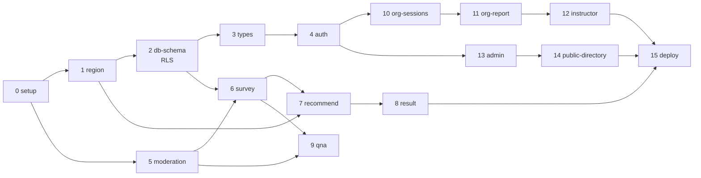

# 구현 계획

Find My Mento MVP 파일럿(경기도 광명시)을 코드로 옮기는 순서다.

이 문서는 **로드맵**이고, 각 step의 실제 실행 명세는 `phases/0-mvp/step{N}.md`에 있다. 둘이 어긋나면 step 파일이 옳다. 기획 근거는 `docs/PRD.md`, 권한·데이터 모델은 `docs/ARCHITECTURE.md`, 기술 결정은 `docs/ADR.md`, AI 기능의 범위와 경계는 `docs/AI.md`를 본다.

## 현재 상태 (2026-09-12 갱신)

| 항목 | 상태 |
|---|---|
| 기획·설계 문서 | 완료 (PRD · ARCHITECTURE · ADR 15개 · USER_FLOW · SURVEY · UI_GUIDE) |
| 코드 | **step 0~15 구현 완료.** 라우트 41개, 빌드·린트·테스트 통과 (218 tests) |
| DB | 마이그레이션 + 부트스트랩 + 픽스처 SQL 작성 완료 (19 테이블 + RLS + 역할 함수). **적용은 미완** — B-3 |
| 배포 | **환경변수 0개로 Vercel 배포 가능.** 절차는 `docs/DEPLOY.md`. 남은 것은 실물 QR 검증뿐 |

step 파일 11~15는 결국 쓰지 않았다. 대신 아래 "미작성 step 명세"를 그대로 구현했고, 결과는 `phases/0-mvp/index.json` 에 step별로 기록돼 있다. `scripts/execute.py` 경유 실행은 하지 않았으므로 B-1·B-2는 더 이상 실행 블로커가 아니다.

### 키 없이 도는 이유

Supabase 키가 없으면 앱이 **데모 데이터 모드**로 동작한다 (`src/data/demo.ts`). 조회·집계 로직은 `Dataset` 위의 순수 함수 한 벌이고, 데이터 출처만 `src/lib/db/dataset.ts` 가 가른다. 키를 넣는 순간 같은 코드가 실 DB(RLS 적용)로 붙는다. 자세한 건 `README.md`.

---

## 남은 블로커

### B-3. Supabase 프로젝트 (실 DB 모드의 유일한 차단 조건)

이 환경에는 Docker와 Supabase CLI가 없어 로컬 스택을 못 쓴다. **원격 프로젝트**가 필요하다.
Docker 없이도 되고, CLI 없이 대시보드 SQL Editor만으로도 된다 — 30분 작업이다. 절차는 `docs/DEPLOY.md` 2단계.

- `.env.local` / Vercel — `NEXT_PUBLIC_SUPABASE_URL`, `NEXT_PUBLIC_SUPABASE_ANON_KEY`, `SUPABASE_SERVICE_ROLE_KEY`
- Authentication → URL Configuration 에 `/login/callback` 등록 (이걸 빼먹으면 매직링크가 돌아오지 않는다)

**차단되는 범위는 실 DB 모드뿐이다.** 키가 없어도 데모 모드로 Vercel 배포·화면 검수·기관 미팅은 전부 된다.
추측값·더미 프로젝트로 진행하면 안 된다 — 이후 모든 쓰기가 엉뚱한 DB로 간다.

적용 순서는 SQL 3개다. `migrations` → `bootstrap.sql`(첫 운영자 연결, 없으면 **아무도 로그인할 수 없다**) → `seed.sql`(선택, 검수·RLS 테스트용 픽스처).

### B-4. LLM API 키 (step 7, 차단 아님)

`ANTHROPIC_API_KEY`가 없어도 **규칙 기반 순위로 200을 반환해야 한다**(E-06, ADR-004). 즉 키가 없어도 step 7은 완료될 수 있고, 추천 품질 확인만 미뤄진다. 키 없음을 이유로 step을 멈추지 말 것.

---

## 로드맵 (16 step)

| # | step | 무엇을 만드나 | 의존 | 상태 |
|---|---|---|---|---|
| 0 | `project-setup` | Next.js 15 App Router + TS strict + Tailwind + Vitest, 디렉토리 골격, 디자인 토큰, UI 프리미티브 4개 | — | 명세 있음 |
| 1 | `region-data` | 수도권 66개 시군구 인접 JSON + 확장 로직(1-hop → 2-hop). **"같은 시도" 단계 금지** | 0 | 명세 있음 |
| 2 | `db-schema` | **테이블 19개 + 전부 RLS + 역할 판별 함수 + 네거티브 테스트 14개.** 이 제품의 안전 설계가 실제로 구현되는 유일한 지점 | 0·1 | 명세 있음 · **B-3** |
| 3 | `types-and-client` | DB 타입 생성, `lib/supabase` server/client, 역할 판별 래퍼 | 2 | 명세 있음 |
| 4 | `entry-and-auth` | 랜딩 1장, 매직링크 로그인, 초대 수락(1회용·만료 검증·멱등), 역할별 분기 | 3 | 명세 있음 |
| 5 | `moderation-filter` | 연락처·외부링크·이름 마스킹 필터. E-08·09·10·22가 전부 이걸 재사용한다 | 0 | 명세 있음 |
| 6 | `survey-flow` | `/s/[code]` 진입 → 가명코드 또는 익명 → 설문 7문항 → 제출 API. 화면 주제는 "나에게 맞는 다음 교육 찾기" | 2·3·5 | 명세 있음 |
| 7 | `recommend-engine` | 규칙 필터(SQL)로 후보 확정 → LLM이 순위·이유 한 줄. **LLM 실패 시 규칙 fallback 필수** | 1·2·6 | 명세 있음 · B-4 |
| 8 | `student-result` | 추천 카드, 관심 표현, 0건 → Q&A 유도(파일럿에서 과반 예상) | 7 | 명세 있음 |
| 9 | `qna` | 공개 Q&A 열람·작성·답변·숨김 처리 | 5·6 | 명세 있음 |
| 10 | `org-sessions` | 회차 생성 + **배정 강사 지정** + 입장코드·QR + 가명코드 일괄 발급·인쇄 | 4 | 명세 있음 |
| 11 | `org-report` | 회차 리포트, 수요 클러스터, 미충족 수요, 관심 표현 검토, 동의 기록, 섭외 요청 발송 | 10 | 구현 완료 (step 파일 없음) |
| 12 | `instructor-workspace` | 프로필·프로그램, 배정 회차 + 교실 QR 투사 + 회차 리포트, 지역 수요, 섭외 수락, 문의 리드 | 10·11 | 구현 완료 (step 파일 없음) |
| 13 | `admin-review` | 업체·강사 등록, 증빙 심사, 초대 발송, 미답변 큐 | 4 | 구현 완료 (step 파일 없음) |
| 14 | `public-directory` | `/programs`, `/instructors/[id]`, `/inquiry` + `inquiries` 접수 API + 운영자 배정 | 13 | 구현 완료 (step 파일 없음) |
| 15 | `deploy` | 배포 절차·부트스트랩·세션 갱신·`/api/health`·번들 키 검사 | 전부 | 코드 완료 · **실물 QR 미검증** |



**step 2가 전체의 목이다.** 여기서 RLS를 느슨하게 깔면 이후 13개 step이 전부 그 위에 쌓인다. 테스트가 막힐 때 정책을 풀지 말고 쿼리를 고친다.

---

## 미작성 step 명세 (step 파일로 옮길 내용)

아래는 개요다. step 파일로 쓸 때는 `.claude/commands/harness.md`의 D-3 템플릿(읽어야 할 파일 / 작업 / AC / 검증 절차 / 금지사항)을 따르고, **자기완결적으로** 쓴다 — 각 step은 독립 세션에서 실행된다.

### step 11 · `org-report`

UC-17·18·19·20·21, E-04·14·15·16·24. 기관·학교 담당자의 의사결정 화면이고 **H5(섭외 요청 발송 ≥ 1건)가 여기서 측정된다.**

- 회차 리포트 — 응답 수, 만족도 분포, **후속 의향을 만족도보다 크게** 표시, 분야별 집계, 익명 응답 수 별도 표기(E-04)
- 수요 클러스터 — 분야 × 학년대. 자유서술(`want_to_learn`) 인용구를 함께 보여준다
- 미충족 수요 — 관심 있는데 지역 공급 0인 분야를 따로 모음(E-16). 파일럿에서 가장 많이 쌓일 데이터
- 관심 표현 검토 — 승인·반려, 반려도 수요 집계에는 남긴다
- 보호자 동의 **기록**(`consents`) — 플랫폼이 동의를 받는 게 아니라 기관이 받은 결과를 기록한다. UI 문구로 이걸 분명히
- 섭외 요청 발송 + 상태 추적, 거절 시 같은 분야 대체 강사 제안(E-15)
- 응답 0건 회차를 목록에서 눈에 띄게 — 강사가 안내를 빼먹은 신호다(E-24)
- 등록 업체·강사 수를 화면에 명시(UI_GUIDE 안전규칙 5)

### step 12 · `instructor-workspace`

UC-13·14·15·16·28·29·33, E-23. **강사 구독료를 정당화하는 화면 전체가 여기다.**

- 프로필·프로그램 조회·수정
- **배정 회차 목록** — `lecture_sessions.instructor_id = app.current_instructor_id()`인 것만
- **교실 투사용 QR 화면**(UC-28) — step 10의 컴포넌트 재사용. 전체화면 단일 요소, QR 최소 320px, 입장코드 `text-5xl tabular-nums`, 네비 숨김. 안내 문구는 "만족도 조사"가 아니라 "나에게 맞는 다음 교육을 찾아줘요"
- **회차 리포트**(UC-29) — 학교에 제출하는 산출물. **집계치만.** 학생 단위 원본 응답은 RLS가 막는다
- 지역 수요 집계(UC-15) — 집계치만
- 섭외 요청 수락·거절(UC-16)
- 배정된 보호자 문의 리드(UC-33) — `assigned_instructor_id`가 자기인 것만
- 금지: 학생 가명코드 단위 응답 노출, 배정되지 않은 회차 접근, 회차 생성·수정 UI

### step 13 · `admin-review`

UC-23·24·25·26, E-11·13·20.

- 업체·강사 등록(운영자 대행 — ADR-008)
- 증빙 업로드 → **Supabase Storage 비공개 버킷**. 심사 승인·거부
- `pending`·`rejected`·`suspended` 강사는 추천·디렉토리·Q&A 어디에도 노출되지 않음을 테스트로 고정(E-11)
- 기관·학교·강사 초대 발송(1회용 토큰·만료)
- 미답변 Q&A 큐 — 48시간 초과 표시(E-20)
- `org_members` 비활성화(E-13) — 계정 삭제가 아니라 접근 차단

### step 14 · `public-directory`

UC-30·31·32·34, E-07·21·22. **개인 경로 전체.** ADR-014를 먼저 읽는다.

- `/programs` 목록 — 지역·분야·대상학년·형태 필터. Server Component + anon 키
- 빈 상태 3단 확장을 화면에 노출(E-07): `우리 동네 → 인접 → 2-hop → Q&A 유도`. 0건 도달을 미충족 수요로 기록
- `/programs/[id]`, `/instructors/[id]` — **연락처·사진·평점 UI를 만들지 않는다**
- `/inquiry` 폼 — 보호자 이름·연락처·지역·**학년대**·분야·요청내용 + 개인정보 동의 체크박스
- `POST /api/inquiry` — 필수값·길이·금칙어·레이트 리밋 검증 후 INSERT. **클라이언트 직접 INSERT 금지**(E-21). 요청 내용은 마스킹 필터 통과(E-22)
- 접수 완료 화면에 **연락 예상 시점 명시**
- 운영자 문의 배정 화면(UC-32) — 확인 → `assigned_instructor_id` 지정 또는 반려
- 금지: 아이 이름·학교 입력란, 보호자 로그인·마이페이지, 학생용 "신청" 버튼, `inquiries` anon SELECT

### step 15 · `deploy` — 구현된 것

ADR-012. Vercel + Supabase 호스티드. 절차 문서는 `docs/DEPLOY.md`.

- `docs/DEPLOY.md` — 데모 배포(환경변수 0개) / 실 DB 연결 2단계로 분리한 클릭 순서. 자주 막히는 곳 표 포함
- `supabase/bootstrap.sql` — **첫 운영자 연결.** 셀프 가입이 없어서(ADR-011) 이게 없으면 마이그레이션 직후 DB 에 아무도 들어갈 수 없다. 이메일을 고치지 않으면 일부러 실패한다
- `supabase/seed.sql` — 검수·RLS 테스트용 고정 픽스처. 마지막 `select` 가 `RLS_TEST_*` 환경변수 값을 그대로 출력한다 → 건너뛰던 네거티브 테스트 14개를 실제로 돌릴 수 있다
- `src/middleware.ts` — **세션 쿠키 갱신 전용.** Server Component 는 쿠키를 못 써서 이게 없으면 access token 만료 후 대시보드가 전부 `/login` 으로 튕긴다. 역할 판단은 여기서 하지 않는다 (layout 의 `getActor()` 가 테이블 조회로 한다)
- `/api/health` — `mode`(demo/live) · 환경변수 설정 여부(boolean) · `student_entry_example`. **키 값은 내려보내지 않는다.** QR 도메인 오타를 교실에 들어가기 전에 잡는 지점
- `tests/bundle-secrets.test.ts` — 빌드 산출물(`.next/static`)을 직접 열어 서버 전용 키를 찾는다. 환경변수 이름·실제 값·service_role JWT·`sk-ant-` 형식까지 본다. `npm run verify` 가 lint → build → test 순으로 돌린다
- `src/data/demo.ts` 날짜 상대화 — 고정 날짜를 박아 두면 배포해 둔 데모가 며칠 뒤 전부 마감 회차가 되고 학생 설문이 E-17 로 거부된다. `DEMO_NOW` 기준 상대값으로 바꿨고 테스트도 같은 기준을 쓴다

**남은 것 하나 — 실물 휴대폰 QR 스캔 + 모바일 레이아웃 검증.** ADR-012가 인정한 리스크가 여기서 한 번에 터진다. `/project/{sessionId}` 를 프로젝터에 띄우고 **교실 뒤쪽 좌석에서** 찍는다. 앞에서만 찍어 보면 의미가 없다. 파일럿 현장 투입 전 반드시 통과. 체크리스트는 `docs/DEPLOY.md` 3절.

---

## 병렬 트랙 — 코드 밖에서 해야 하는 일

코드와 동시에 진행한다. 이게 안 되면 완성된 코드도 파일럿을 못 돈다.

| 시점 | 할 일 | 막히면 |
|---|---|---|
| 지금 | **설문 문항 확정** (`docs/SURVEY.md` 검토·승인) | 수집한 데이터 전부가 무용해진다 |
| 지금 | 3DNFLY 1호 입점 합의 (사례·데이터 활용 범위, 레퍼런스 조건 무료) | 공급이 0이다 |
| step 2 전 | Supabase dev 프로젝트 생성 + 키 발급 | step 2가 `blocked` |
| step 13 전 | 강사 자격 증빙 + **성범죄경력 조회 증빙** 수집 (업체 경유) | 강사를 승인할 수 없다 |
| step 13 전 | 강사 개인정보 수집·이용 동의 (성인 본인 동의) | 강사 등록이 불법이 된다 |
| step 14 전 | **보호자 문의 폼 개인정보 수집·이용 동의문** (항목·목적·보유기간·제3자 제공=해당 강사) | 개인 경로를 열 수 없다 |
| step 15 전 | 파일럿 기관 개인정보 처리위탁 계약 1부 (**가명코드↔실명 매핑은 기관 보유** 명시) | 학생 데이터를 받을 수 없다 |
| step 15 전 | 가명코드 배부 방식 결정 (스티커 / 명찰 / 좌석표) | H1(응답률)이 무너진다 |
| step 15 전 | **강사용 수업 마무리 안내 스크립트 1장** | 학생 유입이 0이 된다(E-24) |

`inquiries`는 이 플랫폼이 **실제 PII를 보유하는 첫 테이블**이다. 학생 가명코드만 다룰 때는 "기관의 수탁자"였지만, 보호자 연락처를 받는 순간 개인정보 **처리자**가 된다. step 14의 법적 선행조건이다.

---

## 실행

```bash
# B-1을 고치기 전까지는 PYTHONUTF8=1을 붙인다
PYTHONUTF8=1 python scripts/execute.py 0-mvp
PYTHONUTF8=1 python scripts/execute.py 0-mvp --push
```

`execute.py`가 자동 처리하는 것: `feat-0-mvp` 브랜치 생성, 가드레일 주입(CLAUDE.md + docs 전체를 매 step 프롬프트에), 완료 step의 `summary` 누적 전달, 실패 시 3회 자가 교정, 코드/메타데이터 2단계 커밋.

복구:
- `error` → 해당 step의 `status`를 `pending`으로, `error_message` 삭제 후 재실행
- `blocked` → `blocked_reason`을 해결하고 `status`를 `pending`으로, `blocked_reason` 삭제 후 재실행

---

## 완료 판정

**코드 완료 ≠ MVP 성공.** 둘을 따로 본다.

코드 완료 조건 — 16 step 전부 `completed`, `npm run verify`(lint → build → test) 통과, RLS 네거티브 테스트 14개 통과, 배포된 환경에서 실물 QR 스캔 성공.

현재 남은 두 줄이 정확히 이것이다. 둘 다 **키와 실물 기기가 있어야** 넘을 수 있고, 코드로는 더 할 것이 없다.
- RLS 네거티브 14개 — Supabase 프로젝트 + `seed.sql` 적용 후 `npm test` (B-3)
- 실물 QR 스캔 — 배포 후 교실 뒤쪽 좌석에서 (`docs/DEPLOY.md` 3절)

MVP 성공 조건 — **기관이 섭외 요청을 1건이라도 실제로 발송한다**(H5). 여기에 보호자 문의 1건(H9)이 붙으면 개인 경로까지 검증된다. 나머지 가설(H1~H4·H6~H8·H10)은 그 1건을 만들기 위한 경로이거나 다음 판돈을 재는 장치다.

가설이 깨졌을 때의 해석은 `docs/USER_FLOW.md` 10절에 전부 적혀 있다. **숫자가 안 나오면 기능을 더 만드는 게 답이 아니다.**

---

## 파일럿 이후 (범위 밖 — 지금 만들지 않는다)

- Phase 1.5 — 보호자 계정·결제, 강사 셀프 온보딩(신원 검증 체계 선행), 리포트 PDF 내보내기
- Phase 2 — 중개 수수료, 지자체·교육지원청 수요 리포트·위탁사업, 학교 행정망 연동, 전국 229개 시군구 확장
- 영구 제외 — 1:1 비공개 메시지, 실시간 채팅·푸시 (ADR-006)
